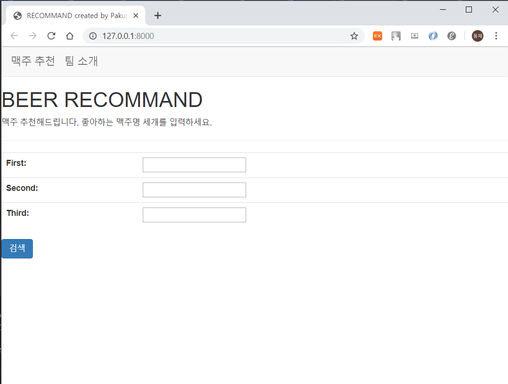
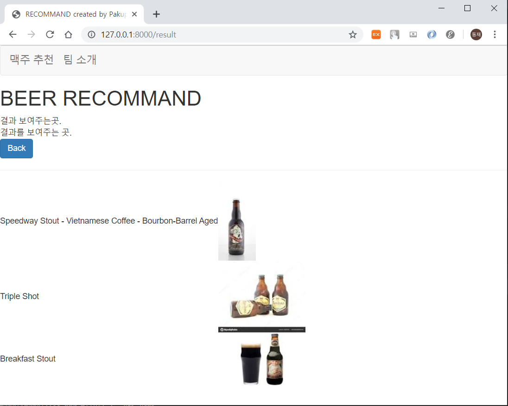
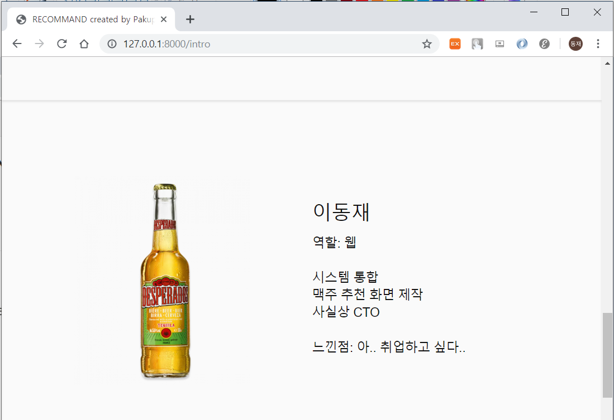

# beer_web
## 개요
DJango로 구현한 리뷰 기반 맥주 추천 알고리즘입니다.

리뷰는 https://www.beeradvocate.com/ 에서 추출하였고, 추출한 리뷰를 알고리즘에 적합하게 전처리를 거친 후 페이지랭크 알고리즘을 기반으로 하여 맥주 추천 모델을 설계하였습니다.

현재 github은 알고리즘이 적용된, 추천 웹 페이지와 팀원 소개 페이지를 구현한 Django 소스 코드이며, 전처리 및 맥주 추천 알고리즘은 하단에 걸어둔 github 링크를 통해 확인하실 수 있습니다.

https://github.com/pakupoko/NHE - fork한 팀 프로젝트 소스코드

## 구동
myweb/config/settings.py 에 Database를 설정을 해야 구동됩니다.

또, 로컬 DB에 데이터를 이식하고, 추가로 입력로그 기록 테이블을 구축해야 작동됩니다.

데이터셋은 CSV파일 형태로 현재 git 폴더 내 beer_data 폴더에 보관되어 있습니다.

라이브러리 몇 개를 설치해야 합니다. django, pandas, django-pandas 입니다. 최신 버전 기반으로 적용하면 문제없이 작동하겠지만, 문제 발생시 알려주시면 확인해보겠습니다. 또 추가 설치가 필요한 라이브러리가 있다면 README에 업데이트 하겠습니다.

$python mange.py runserver 명령어를 통해 작동하여 서버를 구축하고, 생성된 주소로 들어가면 밑의 초기화면이 켜집니다.

페이지 내에 세 개의 입력 칸에, 좋아하는 맥주를 입력하면 됩니다.

다만 입력 맥주의 경우, 해외에서 유명한 크래프트 비어 위주라 우리가 잘 알고 있는 맥주들은 리스트에 없으며, 이름이 완전히 매칭이 되지 않으면 오류가 발생합니다. 이 부분은 이후 업데이트 할 예정입니다.

맥주 리스트는 DB에서 탐색하여 입력하면 됩니다.

맥주 세개를 입력하면 유사한 맥주 3개를 이름과 사진으로 출력합니다.

맨 위의 상단바를 통해 팀원들의 간단한 소개가 있는 페이지로 이동할 수 있습니다.

